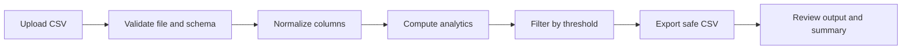
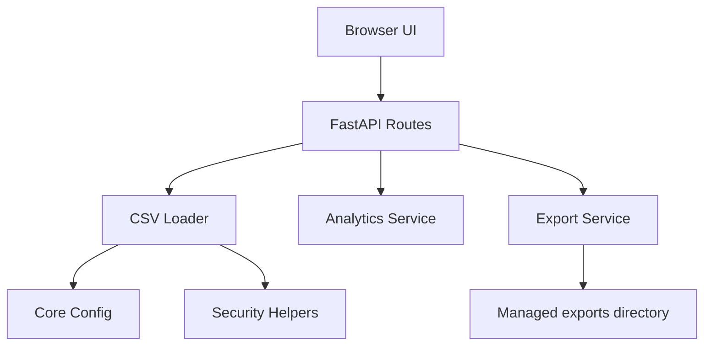

# Employee Data Analysis

A secure, local-first employee CSV analysis application built with Python, FastAPI, Pandas, and a lightweight browser interface.

<div align="center">
  
</div>

## Overview

This project turns raw employee CSV files into a clean, validated, and filtered dataset summary. It focuses on safe local processing, transparent validation results, and a simple workflow that works well for demos, portfolio use, and future extension.

### What the app does

- uploads and validates CSV files
- maps common employee column aliases to a canonical schema
- measures average salary and department distribution
- filters employees by a salary threshold
- exports a sanitized CSV in a controlled output directory

## Project highlights

<div align="center">

| Feature | Value |
|---|---|
| Secure by default | File type, size, path traversal, and formula injection checks |
| Data-aware | Schema mapping handles common naming variations |
| Local-first | No database or external cloud dependency required |
| Portfolio ready | Clean demo UI and API flow for presentations |

</div>

## End-to-end user flow



### Flow steps

1. User uploads an employee CSV in the browser or via API.
2. The backend validates file type, filename safety, size, and required columns.
3. Salary and employee fields are normalized and coerced.
4. Aggregate statistics are computed from valid rows only.
5. A threshold filter selects relevant employees.
6. Exported results are written only inside the managed `exports/` folder.

## Architecture at a glance



### Layer breakdown

- UI layer: minimal browser demo for upload, analyze, and export
- API layer: FastAPI endpoints for upload, analysis, export, and health checks
- Service layer: validation, analytics, and export logic
- Core layer: configuration and security utilities

## Tech stack

- Python 3.12+
- FastAPI
- Pandas
- Jinja2 for the demo page
- Pytest + Ruff for verification

## Setup

### Prerequisites

- Python 3.12+
- local virtual environment
- repository access

### Install

```bash
python -m venv .venv
# Windows PowerShell
.\.venv\Scripts\Activate.ps1
# macOS/Linux
source .venv/bin/activate

python -m pip install --upgrade pip
python -m pip install -e ".[dev]"
```

### Run the app

```bash
uvicorn app.main:app --reload
```

Then open:

- http://127.0.0.1:8000/
- http://127.0.0.1:8000/docs

## Project structure

```text
Employee-Data-Analysis/
├── app/
│   ├── api/
│   │   └── routes.py
│   ├── core/
│   │   ├── config.py
│   │   └── security.py
│   ├── services/
│   │   ├── analytics.py
│   │   ├── csv_loader.py
│   │   └── export.py
│   ├── templates/
│   │   └── index.html
│   ├── __init__.py
│   └── main.py
├── data/
│   └── sample_employees.csv
├── docs/
│   ├── api.md
│   ├── architecture.md
│   └── security.md
├── exports/
├── tests/
│   └── unit/
├── .gitignore
├── .env.example
├── PRD.md
├── pyproject.toml
├── README.md
└── requirements.md
```

## API endpoints

### POST /api/upload

Upload a CSV for validation.

Example:

```bash
curl -X POST "http://127.0.0.1:8000/api/upload" \
  -F "file=@data/sample_employees.csv"
```

### POST /api/analyze

Validate the file and compute aggregate employee metrics.

Example:

```bash
curl -X POST "http://127.0.0.1:8000/api/analyze" \
  -F "file=@data/sample_employees.csv" \
  -F "threshold=70000" \
  -F "include_equal=false"
```

### POST /api/export

Filter the dataset and save a safe CSV export.

Example:

```bash
curl -X POST "http://127.0.0.1:8000/api/export" \
  -F "file=@data/sample_employees.csv" \
  -F "threshold=70000" \
  -F "include_equal=false" \
  -F "filename=demo_export.csv"
```

### GET /api/health

Simple health check endpoint.

## Canonical schema

The loader uses a canonical schema instead of assuming a single fixed Kaggle layout.

- `employee_id`
- `name`
- `department`
- `salary`
- `joining_date` (optional)

Common aliases include:

- `employee_id`: `employee_id`, `Employee ID`, `employeeid`, `emp_id`
- `name`: `name`, `employee_name`, `Employee Name`
- `department`: `department`, `Department`
- `salary`: `salary`, `annual_salary`, `base_salary`, `Salary`
- `joining_date`: `joining_date`, `date_of_joining`, `Joining Date`

## Security controls

This project treats uploaded data as untrusted input.

### Implemented protections

- CSV extension and size validation
- filename sanitization and path traversal rejection
- controlled output directory enforcement
- formula-neutralization for spreadsheet payloads
- structured validation summaries instead of silent data loss
- limited error responses to avoid leaking internal filesystem details

## Demo usage

A sample employee dataset is included in [data/sample_employees.csv](data/sample_employees.csv) for local testing.

1. Start the app with `uvicorn app.main:app --reload`.
2. Open the browser UI at http://127.0.0.1:8000/.
3. Upload the sample CSV.
4. Set a salary threshold such as `70000`.
5. Click Analyze to review summary metrics.
6. Click Export CSV to generate the filtered result.

## Quality checks

```bash
python -m pytest -q
python -m ruff check .
```

### Verified status

- automated tests pass
- lint checks pass
- warnings are dependency deprecation warnings from FastAPI/Starlette, not application failures

## Known limitations

- the real Kaggle dataset is not included in the workspace
- currency assumptions are not confirmed against a real source dataset
- the app is intentionally local-first and does not include cloud deployment
- the UI is a demo-friendly interface rather than a full enterprise dashboard

## Why this project is valuable

This project demonstrates a strong portfolio mix of:

- secure file handling
- structured data validation
- analytics and data filtering
- safe export controls
- Python API development
- end-to-end local workflow design

## Final note

This project is a solid foundation for a real-world employee analytics workflow. It is ready for local demonstration, portfolio presentation, and future extension with a production dataset once that source becomes available.
